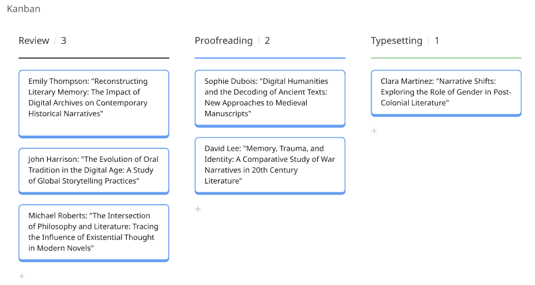

# Task Management in the Publishing Process

An effective scholarly publication requires **clearly defined stages of work** and **efficient task coordination**. Visualising processes enables better tracking of progress and helps eliminate delays.

## How to Effectively Manage Tasks?

✅ Monitor the status of articles (e.g., submission → review → proofreading → layout → publication) and perform regular reviews.

✅ Use automated notification systems to keep track of progress and deadlines.

✅ Establish clear task prioritization rules to focus on the most important activities.

With proper process visualization and suitable tools, working on publications becomes more transparent, efficient, and organized. Project boards and diagrams help editorial teams coordinate tasks better and set priorities.

## **Examples of tools for process visualization:**

📌 Kanban-style tools (e.g., [Google TasksBoard](https://tasksboard.com/), [Trello](https://trello.com/), [Jira](https://www.atlassian.com/pl/software/jira), [Asana](https://asana.com/pl)) – allow you to divide work into stages (sample columns: "Review," "Proofreading," "Typesetting") and create checklists and reminders.

<figure><figcaption>
A sample Kanban board created in Miro visualizing the status of individual articles
</figcaption></figure>

📌 **Gantt Chart** (e.g. MS Excel, Google Spreadsheet, ClickUp) – a bar chart illustrating the project schedule; it helps visualize dependencies between different stages of the workflow.

<figure><figcaption>
Example of using a Gantt Chart in the publication process
</figcaption></figure>

***

## 💡 Questions for Reflection:

* Do we have a clearly defined status for each article in the publication workflow?
* Which task management tools could most effectively improve our publication process?
* Is there room to enhance our workflow by introducing automatic reminders and notifications?
