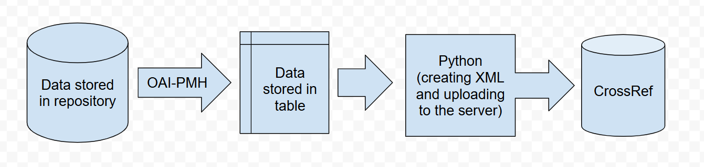

# USE CASE – DOI registration

The following is a description of the successive stages of work on a task concerning the assignment of DOI numbers to archival articles of one of the Polish scientific journals, which did not use any publishing platform in its work. This description concerns a specific case for which a dedicated programming script has been prepared, for which reason the process may not be fully replicable in other cases and may need to be tailored to the specific situation. However, it provides an excellent example of a real-world task that highlights the potential of work automation methods.

Although the example uses the Python programming language, it is not necessary to have technical skills to use similar solutions – it is often enough to work with a technical person or reach for ready-made tools.

## Description of the challenge

The aim of the task was to register DOI numbers for archival articles from one of the Polish scientific journals. The registration had to be done via [CrossRef](https://www.crossref.org/).&#x20;

Due to a lack of technical capacity on the part of the journal's editors, the only solution was manual data entry using registration forms available on the website (e.g. [webDeposit](https://apps.crossref.org/webDeposit/)). The disadvantages of this approach are that the process is very time-consuming, some editors need to be involved for a longer period of time, and there is a potentially high probability of mistakes during data entry.

In order to speed up and facilitate the work, it was decided to commission a script that would be used to upload a packet of data and register the elements contained therein in bulk. The data had to be prepared in XML format according to the metadata schema provided by CrossRef (at the time of writing, the current version of the schema is [5.4.0](https://data.crossref.org/reports/help/schema_doc/5.4.0/index.html)), and then sent using the service's API.


See the [CrossRef documentation](https://www.crossref.org/documentation/register-maintain-records/direct-deposit-xml/) for details on how to prepare the XML file and how to deposit it.


<figure><figcaption><p>Data flow diagram for the task described.</p></figcaption></figure>

The advantage of this approach is the one-time effort. Once the script has been developed, it is ready to be used again and again, unless significant changes are made on the part of the data receiver. This solution saves time and effort for editors, and reduces the likelihood of errors. Tools developed in this way ensure reproducibility, assuming we stick to the instructions for using them.

### Summary of benefits:

✅ **faster process and/or fewer people involved**

**✅  fewer potential errors**

**✅  scalability of the solution**

**✅  reusability**

## Acquisition and cleaning of data

The work on this task can be divided into two stages, the first being the preparation of the metadata to be uploaded during DOI registration. The metadata was not provided by the editors; it had to be obtained from the repository where the articles are deposited.

Metadata was extracted using the OAI-PMH protocol and then manually corrected where data quality did not meet the required criteria.


Find out more about the OAI-PMH metadata exchange protocol [here](https://www.openarchives.org/pmh/).


<figure><figcaption><p>An excerpt of a sample record from the repository and provided by OAI-PMH.</p></figcaption></figure>

Data correction was done using spreadsheets. Below is an excerpt from the data table, where each row corresponds to one article. The content has been prepared so that it does not require any further processing and cleaning. The column headings have been labelled with names corresponding to the tags where the data should be located in the XML file structure.

<figure><figcaption><p>Excerpt from a table with structured record metadata.</p></figcaption></figure>

## Preparation of the script and data transfer

Once the input data was prepared, a Python script was developed. The script was tasked with automatically creating an XML file with article metadata for registration for each journal yearbook, and then depositing it with CrossRef via the API. Each file was then validated and processed on the server side, which took several to several tens of minutes to finally assign DOI numbers to all objects.

The following is a piece of code in Python that creates one of the elements of an XML file based on the rows from the table described earlier. The elements are structured and it is easy to make changes to them if the input or target format were to change

```python
def create_person_metadata(row):
    if row['ORCID']: orcid = 'https://orcid.org/' + row['ORCID']
    else: orcid = ''
    return E.person_name(
                            E.given_name(row['given_name']),
                            E.surname(row['surname']),
                            E.ORCID(orcid),
                            sequence=row['sequence'],
                            contributor_role=row['contributor_role']
                        )
```

The whole script is built up of sections responsible for the various actions required. The section responsible for creating the XML file is divided into functions that create the individual parts of the metadata (an example of such a function can be found above). The output of each function is then combined and stored locally. The files can be manually validated and then uploaded to the server using the rest of the code.


Files can be sent first to a test server to see how the registration process will go.


The entire script, also with input, can be found at this link: [https://github.com/CHC-Computations/CRAFT-OA-training-materials/tree/main/DOI\_Crossref\_registration](https://github.com/CHC-Computations/CRAFT-OA-training-materials/tree/main/DOI_Crossref_registration).

Below is an excerpt of the result of the work, i.e. one of the records displayed by the CrossRef service, together with the assigned DOI number.

<figure><figcaption><p>One of the registered records in the search results of the CrossRef service.</p></figcaption></figure>

## Conclusions

The case described shows that even editors who do not use modern publishing platforms can significantly improve their work with simple automation tools. The creation of a dedicated script not only made it possible to speed up the entire DOI registration process, but also to reduce errors and relieve editors of time-consuming tasks.

Solutions of this type do not always have to be created from scratch – in many cases, off-the-shelf tools or external technical support will suffice. The key is to see the potential in data and processes that have previously been done manually, and consider where they are worth automating.

It is worth treating such examples as inspiration to seek improvements in our own operations.
